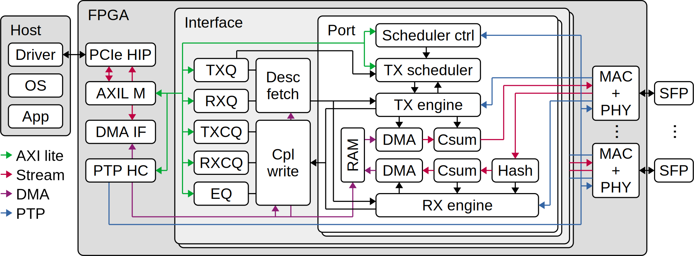

# Corundum Readme

[](https://github.com/corundum/corundum/actions/)

GitHub repository: https://github.com/corundum/corundum

GitHub wiki: https://github.com/corundum/corundum/wiki

Google group: https://groups.google.com/d/forum/corundum-nic

Slack workspace: https://join.slack.com/t/corundumworkspace/shared_invite/zt-tj5azsbm-V9LV8L7ugSRDBpe2JiPKMA

## Introduction

Corundum is an open-source, high-performance FPGA-based NIC.  Features include a high performance datapath, 10G/25G/100G Ethernet, PCI express gen 3, a custom, high performance, tightly-integrated PCIe DMA engine, many (1000+) transmit, receive, completion, and event queues, scatter/gather DMA, MSI interrupts, multiple interfaces, multiple ports per interface, per-port transmit scheduling including high precision TDMA, flow hashing, RSS, checksum offloading, and native IEEE 1588 PTP timestamping.  A Linux driver is included that integrates with the Linux networking stack.  Development and debugging is facilitated by an extensive simulation framework that covers the entire system from a simulation model of the driver and PCI express interface on one side to the Ethernet interfaces on the other side.

Corundum has several unique architectural features.  First, transmit, receive, completion, and event queue states are stored efficiently in block RAM or ultra RAM, enabling support for thousands of individually-controllable queues.  These queues are associated with interfaces, and each interface can have multiple ports, each with its own independent scheduler.  This enables extremely fine-grained control over packet transmission.  Coupled with PTP time synchronization, this enables high precision TDMA.

Corundum also provides an application section for implementing custom logic.  The application section has a dedicated PCIe BAR for control and a number of interfaces that provide access to the core datapath and DMA infrastructure.

Corundum currently supports Xilinx Virtex 7, UltraScale, and UltraScale+ series devices.  Designs are included for the following FPGA boards:

*  Alpha Data ADM-PCIE-9V3 (Xilinx Virtex UltraScale+ XCVU3P)
*  Exablaze ExaNIC X10/Cisco Nexus K35-S (Xilinx Kintex UltraScale XCKU035)
*  Exablaze ExaNIC X25/Cisco Nexus K3P-S (Xilinx Kintex UltraScale+ XCKU3P)
*  Silicom fb2CG@KU15P (Xilinx Kintex UltraScale+ XCKU15P)
*  NetFPGA SUME (Xilinx Virtex 7 XC7V690T)
*  Intel Stratix 10 MX dev kit (Intel Stratix 10 MX 1SM21CHU1F53E1VG)
*  Xilinx Alveo U50 (Xilinx Virtex UltraScale+ XCU50)
*  Xilinx Alveo U200 (Xilinx Virtex UltraScale+ XCU200)
*  Xilinx Alveo U250 (Xilinx Virtex UltraScale+ XCU250)
*  Xilinx Alveo U280 (Xilinx Virtex UltraScale+ XCU280)
*  Xilinx VCU108 (Xilinx Virtex UltraScale XCVU095)
*  Xilinx VCU118 (Xilinx Virtex UltraScale+ XCVU9P)
*  Xilinx VCU1525 (Xilinx Virtex UltraScale+ XCVU9P)
*  Xilinx ZCU106 (Xilinx Zynq UltraScale+ XCZU7EV)

For operation at 10G and 25G, Corundum uses the open source 10G/25G MAC and PHY modules from the verilog-ethernet repository, no extra licenses are required.  However, it is possible to use other MAC and/or PHY modules.

Operation at 100G on Xilinx UltraScale+ devices currently requires using the Xilinx CMAC core with RS-FEC enabled, which is covered by the free CMAC license.

## Documentation

### Block Diagram



Block diagram of the Corundum NIC. PCIe HIP: PCIe hard IP core; AXIL M: AXI lite master; DMA IF: DMA interface; PTP HC: PTP hardware clock; TXQ: transmit queue manager; TXCQ: transmit completion queue manager; RXQ: receive queue manager; RXCQ: receive completion queue manager; EQ: event queue manager; MAC + PHY: Ethernet media access controller (MAC) and physical interface layer (PHY).

### Modules

#### `cmac_pad` module

Frame pad module for 512 bit 100G CMAC TX interface.  Zero pads transmit frames to minimum 64 bytes.

#### `cpl_op_mux` module

Completion operation multiplexer module.  Merges completion write operations from different sources to enable sharing a single `cpl_write` module instance.

#### `cpl_queue_manager` module

Completion queue manager module.  Stores device to host queue state in block RAM or ultra RAM.

#### `cpl_write` module

Completion write module.  Responsible for enqueuing completion and event records into the completion queue managers and writing records into host memory via DMA.

#### `desc_fetch` module

Descriptor fetch module.  Responsible for dequeuing descriptors from the queue managers and reading descriptors from host memory via DMA.

#### `desc_op_mux` module

Descriptor operation multiplexer module.  Merges descriptor fetch operations from different sources to enable sharing a single `desc_fetch` module instance.

#### `event_mux` module

Event mux module.  Enables multiple event sources to feed the same event queue.

#### `mqnic_core` module

Core module.  Contains the interfaces, asynchronous FIFOs, PTP subsystem, statistics collection subsystem, and application block.

#### `mqnic_core_pcie` module

Core module for a PCIe host interface.  Wraps `mqnic_core` along with generic PCIe interface components, including DMA engine and AXI lite masters.

#### `mqnic_core_pcie_us` module

Core module for a PCIe host interface on Xilinx 7-series, UltraScale, and UltraScale+.  Wraps `mqnic_core_pcie` along with FPGA-specific interface logic.

#### `mqnic_interface` module

Interface module.  Contains the event queues, interface queues, and ports.

#### `mqnic_port` module

Port module.  Contains the transmit and receive datapath components, including transmit and receive engines and checksum and hash offloading.

#### `mqnic_ptp` module

PTP subsystem.  Contains one `mqnic_ptp_clock` instance and a parametrizable number of `mqnic_ptp_perout` instances.

#### `mqnic_ptp_clock` module

PTP clock module.  Contains an instance of `ptp_clock` with a register interface.

#### `mqnic_ptp_perout` module

PTP period output module.  Contains an instance of `ptp_perout` with a register interface.

#### `mqnic_tx_scheduler_block_rr` module

Transmit scheduler block with round-robin transmit scheduler and register interface.

#### `mqnic_tx_scheduler_block_rr_tdma` module

Transmit scheduler block with round-robin transmit scheduler, TDMA scheduler, TDMA scheduler controller, and register interface.

#### `queue_manager` module

Queue manager module.  Stores host to device queue state in block RAM or ultra RAM.

#### `rx_checksum` module

Receive checksum computation module.  Computes 16 bit checksum of Ethernet frame payload to aid in IP checksum offloading.

#### `rx_engine` module

Receive engine.  Manages receive datapath operations including descriptor dequeue and fetch via DMA, packet reception, data writeback via DMA, and completion enqueue and writeback via DMA.  Handles PTP timestamps for inclusion in completion records.

#### `rx_hash` module

Receive hash computation module.  Extracts IP addresses and ports from packet headers and computes 32 bit Toeplitz flow hash.

#### `stats_collect` module

Statistics collector module.  Parametrizable number of increment inputs, single AXI stream output for accumulated counts.

#### `stats_counter` module

Statistics counter module.  Receives increments over AXI stream and accumulates them in block RAM, which is accessible via AXI lite.

#### `stats_dma_if_pcie` module

Collects DMA-related statistics for `dma_if_pcie` module, including operation latency.

#### `stats_dma_if_latency` module

DMA latency measurement module.

#### `stats_pcie_if` module

Collects TLP-level statistics for the generic PCIe interface.

#### `stats_pcie_tlp` module

Extracts TLP-level statistics for the generic PCIe interface (single channel).

#### `tdma_ber_ch` module

TDMA bit error ratio (BER) test channel module.  Controls PRBS logic in Ethernet PHY and accumulates bit errors.  Can be configured to bin error counts by TDMA timeslot.

#### `tdma_ber` module

TDMA bit error ratio (BER) test module.  Wrapper for a tdma_scheduler and multiple instances of `tdma_ber_ch`.

#### `tdma_scheduler` module

TDMA scheduler module.  Generates TDMA timeslot index and timing signals from PTP time.

#### `tx_checksum` module

Transmit checksum computation and insertion module.  Computes 16 bit checksum of frame data with specified start offset, then inserts computed checksum at the specified position.

#### `tx_engine` module

Transmit engine.  Manages transmit datapath operations including descriptor dequeue and fetch via DMA, packet data fetch via DMA, packet transmission, and completion enqueue and writeback via DMA.  Handles PTP timestamps for inclusion in completion records.

#### `tx_scheduler_ctrl_tdma` module

TDMA transmit scheduler control module.  Controls queues in a transmit scheduler based on PTP time, via a `tdma_scheduler` instance.

#### `tx_scheduler_rr` module

Round-robin transmit scheduler.  Determines which queues from which to send packets.

### Source Files

    cmac_pad.v                         : Pad frames to 64 bytes for CMAC TX
    cpl_op_mux.v                       : Completion operation mux
    cpl_queue_manager.v                : Completion queue manager
    cpl_write.v                        : Completion write module
    desc_fetch.v                       : Descriptor fetch module
    desc_op_mux.v                      : Descriptor operation mux
    event_mux.v                        : Event mux
    event_queue.v                      : Event queue
    mqnic_core.v                       : Core logic
    mqnic_core_pcie.v                  : Core logic for PCIe
    mqnic_core_pcie_us.v               : Core logic for PCIe (UltraScale)
    mqnic_interface.v                  : Interface
    mqnic_port.v                       : Port
    mqnic_ptp.v                        : PTP subsystem
    mqnic_ptp_clock.v                  : PTP clock wrapper
    mqnic_ptp_perout.v                 : PTP period output wrapper
    mqnic_tx_scheduler_block_rr.v      : Scheduler block (round-robin)
    mqnic_tx_scheduler_block_rr_tdma.v : Scheduler block (round-robin TDMA)
    queue_manager.v                    : Queue manager
    rx_checksum.v                      : Receive checksum offload
    rx_engine.v                        : Receive engine
    rx_hash.v                          : Receive hashing module
    stats_collect.v                    : Statistics collector
    stats_counter.v                    : Statistics counter
    stats_dma_if_pcie.v                : DMA interface statistics
    stats_dma_latency.v                : DMA latency measurement
    stats_pcie_if.v                    : PCIe interface statistics
    stats_pcie_tlp.v                   : PCIe TLP statistics
    tdma_ber_ch.v                      : TDMA BER channel
    tdma_ber.v                         : TDMA BER
    tdma_scheduler.v                   : TDMA scheduler
    tx_checksum.v                      : Transmit checksum offload
    tx_engine.v                        : Transmit engine
    tx_scheduler_ctrl_tdma.v           : TDMA transmit scheduler controller
    tx_scheduler_rr.v                  : Round robin transmit scheduler

## Testing

Running the included testbenches requires [cocotb](https://github.com/cocotb/cocotb), [cocotbext-axi](https://github.com/alexforencich/cocotbext-axi), [cocotbext-eth](https://github.com/alexforencich/cocotbext-eth), [cocotbext-pcie](https://github.com/alexforencich/cocotbext-pcie), [scapy](https://scapy.net/), and [Icarus Verilog](http://iverilog.icarus.com/).  The testbenches can be run with pytest directly (requires [cocotb-test](https://github.com/themperek/cocotb-test)), pytest via tox, or via cocotb makefiles.

## Publications

- A. Forencich, A. C. Snoeren, G. Porter, G. Papen, *Corundum: An Open-Source 100-Gbps NIC,* in FCCM'20, [Paper](https://www.cse.ucsd.edu/~snoeren/papers/corundum-fccm20.pdf), [Presentation](https://www.fccm.org/past/2020/forums/topic/corundum-an-open-source-100-gbps-nic/)

- J. A. Forencich, *System-Level Considerations for Optical Switching in Data Center Networks*, [Paper](https://escholarship.org/uc/item/3mc9070t)

## Citation

If you use Corundum in your project please cite one of the following papers
and/or link to the github project:

```
@inproceedings{forencich2020fccm,
    author = {Alex Forencich and Alex C. Snoeren and George Porter and George Papen},
    title = {Corundum: An Open-Source {100-Gbps} {NIC}},
    booktitle = {28th IEEE International Symposium on Field-Programmable Custom Computing Machines},
    year = {2020},
}

@phdthesis{forencich2020thesis,
    author = {John Alexander Forencich},
    title = {System-Level Considerations for Optical Switching in Data Center Networks},
    school = {UC San Diego},
    year = {2020},
    url = {https://escholarship.org/uc/item/3mc9070t},
}
```

## Dependencies

Corundum internally uses the following libraries:

*  https://github.com/alexforencich/verilog-axi
*  https://github.com/alexforencich/verilog-axis
*  https://github.com/alexforencich/verilog-ethernet
*  https://github.com/alexforencich/verilog-pcie
*  https://github.com/solemnwarning/timespec

